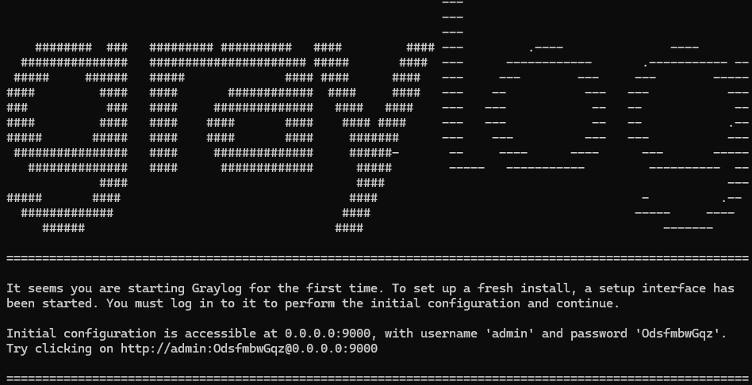

# Documentation d'Installation : Graylog (7.0.4)

**Contexte :** Mettre en place un serveur de centralisation de logs.

---

## 1. Préparation et installation

### 1.1 Installation ISO
* **OS :** Debian 13.1 (Version LTS).
* Vérifier l’intégrité de l’image ISO avant installation.
* Lancer l’installation standard.

### 1.2 Paramétrages réseau
* **IP :** `{IP}/{CIDR}`
* **Gateway :** `{Adresse_IP_Gateway}`
* **Serveur DNS :** `{Windows_Server_rôle_DNS}`
* **Nom FQDN :** `{nom_DNS_du_server}.{nom_de_domaine}`

### 1.3 Configuration machine
* Joindre le poste au domaine (Domaine AD).
* Définir les utilisateurs (ex: `root`, `infra`, etc.).

### 1.4 Gestion du disque
* Mise en place du partitionnement avec **LVM**.
* Points de montage recommandés : `/home`, `/var`, `/tmp` sur des partitions séparées.

### 1.5 Extension de partition
Se référer à la documentation interne : [Étendre un disque LVM](./Extend_Part.md).

### 1.6 Renommer un volume group (VG)

Se référer à la documentation interne : [Renommer un VG (Volume Groupe) LVM](./Rename_VG.md)


### 1.7 Configuration des agents et du pare-feu
* Déployer les agents machine (Veeam, Supervision, etc.).
* Ajouter les règles nécessaires au pare-feu.
* Vérifier la communication avec Internet et le Serveur DNS.

---

## 2. Installation et configuration de Graylog

### 2.1 Prérequis
* Serveur sous Linux (Debian 13).
* Accès administrateur (`root` ou `sudo`).
* Répertoire d'installation pour les conteneurs préparé.

### 2.2 Installation de Docker
1.  Installation des dépendances :
    ```bash
    sudo apt-get install apt-transport-https ca-certificates curl gnupg2 software-properties-common
    ```
2.  Ajouter le dépôt officiel Docker :
    ```bash
    curl -fsSL [https://download.docker.com/linux/debian/gpg](https://download.docker.com/linux/debian/gpg) | gpg --dearmor -o /usr/share/keyrings/docker-archive-keyring.gpg

    echo "deb [arch=amd64 signed-by=/usr/share/keyrings/docker-archive-keyring.gpg] [https://download.docker.com/linux/debian](https://download.docker.com/linux/debian) $(lsb_release -cs) stable" | tee /etc/apt/sources.list.d/docker.list

    apt-get update
    ```
3.  Installation des paquets Docker :
    ```bash
    apt-get install docker-ce docker-ce-cli containerd.io
    ```
4.  Activation au démarrage :
    ```bash
    systemctl enable docker
    ```

### 2.3 Mise en place des conteneurs

1.  Créer le dossier d'installation :
    ```bash
    mkdir -p /opt/graylog
    cd /opt/graylog
    ```
2.  Récupérer les images Docker (Versions : Graylog v7.0.4, MongoDB v8.2.5) :
    ```bash
    docker pull graylog/graylog-datanode:7.0.4
    docker pull graylog/graylog:7.0.4
    docker pull mongo:8.2.5
    ```
3. Créer le fichier `.env`

```bash
# Vous DEVEZ définir un secret pour sécuriser/renforcer (saler) les mots de passe des utilisateurs stockés.
# Utilisez au moins 64 caractères.
# Générez-en un en utilisant par exemple : pwgen -N 1 -s 64
# ATTENTION : Cette valeur doit être la même sur tous les nœuds Graylog du cluster.
# Changer cette valeur après l'installation rendra invalides toutes les sessions utilisateurs 
# et toutes les valeurs chiffrées dans la base de données (ex: jetons d'accès chiffrés).
GRAYLOG_PASSWORD_SECRET="k6sq8kawjx27GlSII5mAUpdlwxJPnkuxREsGdza10NxVVs6SII7ennQ2oy19uWZeYPUdRns2GjPt53zLjSSVC38RDlLxIf8K"

# Vous DEVEZ spécifier un mot de passe haché pour l'utilisateur root (dont vous n'aurez besoin
# que pour la configuration initiale du système et au cas où vous perdriez la connexion 
# avec votre moteur d'authentification).
# Ce mot de passe ne peut pas être modifié via l'API ou l'interface web. Si vous devez le changer,
# modifiez-le dans ce fichier.
# Créez-en un en utilisant par exemple : echo -n votre_mot_de_passe | shasum -a 256
# et insérez la valeur de hachage résultante dans la ligne suivante.
# MODIFIEZ CECI !
# id = admin
GRAYLOG_ROOT_PASSWORD_SHA2="00fc560dda8b1fd3a277b5f5d8ff3e259d39828d42c40f5c43966df5d5ee5664"
```

4. Créer le fichier `docker-compose.yml` complet.

```yaml
services:
  mongodb:
    image: "mongo:8.2.5"
    restart: "on-failure"
    networks:
      - graylog
    volumes:
      - "./.mongodb_data:/data/db"
      - "./.mongodb_config:/data/configdb"

  # ⚠️ Make sure this is set on the host before starting:
  # echo "vm.max_map_count=262144" | sudo tee -a /etc/sysctl.conf
  # sudo sysctl -p
  datanode:
    image: "graylog/graylog-datanode:7.0.4"
    hostname: "datanode"
    environment:
      GRAYLOG_DATANODE_NODE_ID_FILE: "/var/lib/graylog-datanode/node-id"
      # GRAYLOG_DATANODE_PASSWORD_SECRET and GRAYLOG_PASSWORD_SECRET MUST be the same value
      GRAYLOG_DATANODE_PASSWORD_SECRET: "${GRAYLOG_PASSWORD_SECRET}"
      GRAYLOG_DATANODE_MONGODB_URI: "mongodb://mongodb:27017/graylog"
#      GRAYLOG_DATANODE_JAVA_OPTS: "-Xms7g -Xmx7g"
#      GRAYLOG_DATANODE_MAX_MEMORY: "7g"
#      OPENSEARCH_JAVA_OPTS: "-Xms7g -Xmx7g"
    ulimits:
      memlock:
        hard: -1
        soft: -1
      nofile:
        soft: 65536
        hard: 65536
    ports:
      - "127.0.0.1:8999:8999/tcp"   # DataNode API
      - "127.0.0.1:9200:9200/tcp"
      - "127.0.0.1:9300:9300/tcp"
    networks:
      - graylog
    volumes:
      - "./storage/.graylog-datanode:/var/lib/graylog-datanode"
      - "./jvm.options:/etc/graylog/datanode/jvm.options"
      - "./datanode.conf:/etc/graylog/datanode/datanode.conf"
    restart: "on-failure"

  graylog:
    hostname: "server"
    image: "graylog/graylog:7.0.4"
    depends_on:
      mongodb:
        condition: "service_started"
      datanode:
        condition: "service_started"
    entrypoint: "/usr/bin/tini --  /docker-entrypoint.sh"
    environment:
      GRAYLOG_NODE_ID_FILE: "/usr/share/graylog/data/data/node-id"
      # GRAYLOG_DATANODE_PASSWORD_SECRET and GRAYLOG_PASSWORD_SECRET MUST be the same value
      GRAYLOG_PASSWORD_SECRET: "${GRAYLOG_PASSWORD_SECRET}"
      GRAYLOG_ROOT_PASSWORD_SHA2: "${GRAYLOG_ROOT_PASSWORD_SHA2}"
      TZ: "Europe/Paris"
      GRAYLOG_ROOT_TIMEZONE: "Europe/Paris"
#      GRAYLOG_SERVER_JAVA_OPTS: "-Xms2g -Xmx2g -server -XX:+UseG1GC -XX:-OmitStackTraceInFastThrow"
#      GRAYLOG_SERVER_JAVA_OPTS: "-Xms2g -Xmx2g -server -XX:+UseG1GC -XX:-OmitStackTraceInFastThrow -Dmail.smtps.ssl.trust=* -Dmail.smtps.ssl.checkserveridentity=false"
      GRAYLOG_VERSION_CHECK_ENABLED: "false"
      GRAYLOG_SERVER_JAVA_OPTS: "-Xms2g -Xmx2g -server -XX:+UseG1GC -Dmail.smtp.ssl.trust=* -Dmail.smtps.ssl.trust=* -Dmail.smtp.ssl.checkserveridentity=false -Dmail.smtps.ssl.checkserveridentity=false"
      GRAYLOG_HTTP_BIND_ADDRESS: "0.0.0.0:9000"
      GRAYLOG_HTTP_EXTERNAL_URI: "https://SVPL01-SVLOG-03.cgo.local/"
      # Configuration SMTP
      GRAYLOG_TRANSPORT_EMAIL_ENABLED: "true"
      GRAYLOG_TRANSPORT_EMAIL_TLS_TRUST_ALL: "true"
      GRAYLOG_TRANSPORT_EMAIL_HOSTNAME: "10.100.20.7"
      GRAYLOG_TRANSPORT_EMAIL_PORT: 587
      GRAYLOG_TRANSPORT_EMAIL_USE_TLS: "true"
      GRAYLOG_TRANSPORT_EMAIL_USE_SSL: "false"
      GRAYLOG_TRANSPORT_EMAIL_USE_AUTH: "true"
#      GRAYLOG_TRANSPORT_EMAIL_PORT: 465
#      GRAYLOG_TRANSPORT_EMAIL_USE_TLS: "false"
#      GRAYLOG_TRANSPORT_EMAIL_USE_SSL: "true"
      GRAYLOG_TRANSPORT_EMAIL_AUTH_USERNAME: "${GRAYLOG_TRANSPORT_EMAIL_AUTH_USERNAME}"
      GRAYLOG_TRANSPORT_EMAIL_AUTH_PASSWORD: "${GRAYLOG_TRANSPORT_EMAIL_AUTH_PASSWORD}"
      GRAYLOG_TRANSPORT_EMAIL_SUBJECT_PREFIX: "[Graylog]"
      GRAYLOG_TRANSPORT_EMAIL_FROM_EMAIL: "${GRAYLOG_TRANSPORT_EMAIL_AUTH_USERNAME}"
      GRAYLOG_TRANSPORT_FROM_EMAILNAME: "Graylog Alerting"

      GRAYLOG_MONGODB_URI: "mongodb://mongodb:27017/graylog"
    ports:
    - "5044:5044/tcp"   # Beats
    - "514:5140/udp"   # Syslog
    - "514:5140/tcp"   # Syslog
#    - "5555:5555/tcp"   # RAW TCP
#    - "5555:5555/udp"   # RAW UDP
    - "9000:9000/tcp"   # Server API
#    - "12201:12201/tcp" # GELF TCP
#    - "12201:12201/udp" # GELF UDP
    #- "127.0.0.1:10000:10000/tcp" # Custom TCP port
    #- "127.0.0.1:10000:10000/udp" # Custom UDP port
    - "13301:13301/tcp" # Forwarder data
    - "13302:13302/tcp" # Forwarder config
    networks:
      - graylog
    volumes:
      # IMPORTANT: bind mounts (e.g., "./data:/usr/share/graylog/data") currently
      # don't work correctly. You have to use volume mounts.
      # See: https://github.com/Graylog2/docker-compose/issues/99#issuecomment-3800898829
      - "./.graylog_data:/usr/share/graylog/data/data"
      - "./storage/.graylog_journal:/usr/share/graylog/data/journal"
    restart: "on-failure"

networks:
  graylog:
    driver: "bridge"

volumes:
  .mongodb_data:
  .mongodb_config:
  .graylog-datanode:
  .graylog_data:
```

5. Création des dossiers "**`volumes`**"
```bash
mkdir -p .mongodb_config
mkdir -p .mongodb_data
mkdir -p .graylog_data
mkdir -p .graylog-datanode
```
> Ces dossiers permettent de stocker les données de graylog, ce qui évite la `réinitialisation` si les conteneurs sont relancés.
# Documentation : Migration des UID/GID et Résolution de Conflits Graylog

### 2.4 Le conflit de l'ID 999
Sur Debian, l'identifiant numérique 999 est attribué par défaut au groupe système systemd-journal. Or, l'image Docker MongoDB utilise impérativement cet ID 999 pour ses processus internes.

Conséquences du conflit :
- Impossible de créer un groupe mongodb (ID déjà pris par le système).
- Docker ne peut pas écrire dans les volumes car l'hôte Debian bloque l'accès via le groupe systemd-journal.
- Le conteneur MongoDB crash en boucle avec une erreur Permission Denied.

#### 1. Plan de migration des identifiants
Pour que le système fonctionne, nous devons décaler le groupe système et aligner les utilisateurs Docker.

- Logs Système (systemd-journal) -> GID 2000 (Libère la place et modifier le GID comme on le veut)
- MongoDB (mongodb) -> UID/GID 999 (Aligné sur Docker)
- Graylog (graylog) -> UID/GID 1100 (Aligné sur Graylog)

---

#### 2. Procédure technique

##### Étape 1 : Libérer l'ID 999 (Migration systemd-journal)
Exécuter ces commandes pour déplacer le groupe système et mettre à jour les fichiers :


##### 1. Libérer l'ID 999 et réparer le dossier associé à systemd-journal

```bash
groupmod -g 2000 systemd-journal
chgrp -R systemd-journal /var/log/journal
```

##### 2. Signaler le changement au noyau et relancer le service et forcer la MàJ des paramètres

```bash
systemctl restart systemd-journald
sysctl -p
```

##### Étape 2 : Création des utilisateurs cibles
Créer les comptes nécessaires pour que l'hôte reconnaisse les processus Docker :

```bash
groupadd -g 999 mongodb
useradd -u 999 -g 999 -s /usr/sbin/nologin mongodb
groupadd -g 1100 graylog
useradd -u 1100 -g 1100 -s /usr/sbin/nologin graylog
```

##### Étape 3 : Réparation des volumes Docker
Appliquer les bons propriétaires aux dossiers pour permettre aux conteneurs d'écrire dedans :

```bash
cd /opt/graylog
chown -R mongodb:mongodb /opt/graylog/.mongodb_data /opt/graylog/.mongodb_config
chown -R graylog:graylog /opt/graylog/.graylog_data /opt/graylog/.graylog-datanode
```

---

##### 4. Redémarrage et Vérification
Relancez la pile Docker et vérifiez les droits :

```bash
docker compose down
docker compose up -d
ls -al /opt/graylog
```

Résultat attendu : Les dossiers doivent afficher mongodb et graylog comme propriétaires.

Et tester la page `http://ip_locale`.

### 2.5 Installation Graylog

1. Connexion à l'interface d'installation

> Pour se connecter à l'interface d'installation de graylog, il faudra rentrer un identifiant et un mot de passe (temporaire)

L'identifiant par défaut est **`admin`**

Et pour le mot de passe temporaire, il faudra aller regarder les logs du conteneur graylog, le mot de passe sera écrit (sert uniquement pour l'installation).

```bash
docker logs {ID/NOM_Conteneur}
```


2. Installation Graylog

> En premier on a la mise en place du certificat d'autorité, donc soit en créer un par Graylog, soit importer le sien.

On attend que le certificat s'installe bien, et ensuite on finit la configuration, et on redémarre.

> Arrivé sur l'interface, se connecter avec l'identifiant **`admin`** et le mot de passe chiffré avec sha256.

## 3. Mise en place HTTPS + redirection HTTP -> HTTPS
(certificat déjà généré)

## 1. Installation et modules Apache
* **Installation apache 2 et démarrage au lancement**
    * `apt install apache2`
    * `systemctl enable apache2`

* **Activation des modules pour utiliser le reverse proxy**
    * `a2enmod proxy proxy_http ssl headers`
    * `systemctl restart apache2`

## 2. Création et activation du site
* **Création du site en fichier `.conf`**
    * `nano /etc/apache2/sites-available/graylog.conf`

* **Activation du site**
    * `a2ensite graylog.conf`
    * `systemctl reload apache2`

* **Désactiver la page par défaut (la 80)**
    * *(Default) Pour éviter conflit avec docker et graylog*
    * `a2dissite 000-default.conf`

* **Vérification**
    * Configuration finie, tester le site en 80 pour la redirection
    * puis en 443 pour voir s'il fonctionne

## 3. Exemple de Configuration (Reverse Proxy)

* **Schéma :** `nom du site` -> `Contenu` -> `backend`

### Fichier guacamole.conf

# Redirection de HTTP (80) vers HTTPS (443)
```apache
<VirtualHost *:80>
    ServerName {FQDN-Serveur}
    Redirect permanent / https://{FQDN-Serveur}/
</VirtualHost>

<VirtualHost *:443>
    ServerName {FQDN-Serveur}

    SSLEngine On
    SSLCertificateFile {lien_vers_certificat.cer}
    SSLCertificateKeyFile {lien_vers_clé_privée.key}

    # Configuration du Proxy
    ProxyRequests Off
    <Proxy *>
        Order deny,allow
        Allow from all
    </Proxy>

    # Points d'entrée Graylog
    ProxyPreserveHost On
    ProxyPass / http://localhost:9000/
    ProxyPassReverse / http://localhost:9000/

    # Header indispensable pour que Graylog sache qu'il est derrière un proxy HTTPS
    RequestHeader set X-Graylog-Server-URL "https://{FQDN-Serveur}/"
</VirtualHost>
```

# Configuration Graylog (7.0.4)

## 1. Introduction au Concept de Flux
Graylog ne se contente pas d'aspirer des données ; il les traite en temps réel. La configuration suit un chemin logique : **Réception -> Tri -> Transformation -> Stockage**. 
L'objectif est d'optimiser la recherche et de minimiser la consommation de ressources.

---

## 2. Étape 1 : L'Index Set (Le Stockage)
L'Index Set est la destination finale. C'est ici que l'on définit comment les données "physiques" sont gérées sur le disque.

* **Rôle :** Gérer la rotation et la rétention des données.
* **Intérêt :** Permet d'appliquer des durées de conservation (9 mois).

---

## 3. Étape 2 : L'Input (La Réception)
L'Input est le "port d'écoute" qui permet aux serveurs externes d'envoyer leurs données vers Graylog.

* **Rôle :** Ouvrir un point d'entrée réseau (Port 514:UDP).
* **Intérêt :** Adapter la réception des logs sur un port spécifique.

---

## 4. Étape 3 : Le Stream (Filtrage)
Le Stream capture les logs en provenance des Inputs et les dirige vers le bon Index Set.

* **Rôle :** Filtrer les messages en temps réel selon des critères (Rules à configurer).
* **Intérêt :** Organiser les logs par catégories pour faciliter la recherche.
* **Liaison :** Chaque Stream est lié à **`un seul`** Index Set par défaut.

---

## 5. Étape 4 : Le Pipeline (Le Transformateur)
Le Pipeline est le moteur de règles qui modifie le contenu des logs pendant qu'ils circulent dans un Stream.

* **Rôle :** Exécuter des scripts simples (Rules) organisés en étapes (Stages).
* **Intérêt :**
    * **Nettoyer :** Supprimer les champs inutiles pour économiser de l'espace disque.
    * **Valoriser :** Changer le niveau d'un log au besoin suivant des critères.
* **Configuration clé :** Les règles (Rules) et leur ordre d'exécution (Stages).


---

## 6. Synthèse du Flux de Données

| Élément | Fonction |
| :--- | :--- |
| **INPUT** | Reçoit la donnée brute |
| **STREAM** | Oriente vers la bonne catégorie |
| **PIPELINE** | Modifie et enrichit le log |
| **INDEX SET** | Stocke les logs |

---

# Mise en place d'un disque alloué uniquement au stockage des logs

## Utilité ?

Sur graylog, lorsque de nouveaux logs sont stockés dans les index, ils sont mis dans le volumes monté préalablement dans notre `/opt/graylog` sauf que si notre disque venait à être plein de logs, étant donné que le dossier `/opt/graylog` est directement associé à la partition `/` lorsque le disque sera plein, le système ne fonctionnera plus correctement, donc le serveur risquera de planter.

## Mise en place du disque de stockage

Pour celà, il faut ajouter un nouveau disque à notre serveur, on y ajoutera pour commencer un disque de 250Go.

Ensuite il faut le partitionner :  [Partitionner un disque LVM](./Extend_Part.md)

On peut ensuite voir notre partition de 250Go en faisant un `lsblk`

## Monter notre dossier de logs sur le nouveau disque

Avant de monter quelconque dossier sur le disque, il faut déjà savoir lequel monter exactement, pour les logs stockés sur graylog, ils sont situés dans le volume créé au nom `.graylog-datanode`.

Pour éviter tout conflit de droit, je vais créer un dossier nommé `storage` où je mettrais à l'intérieur les dossiers qui devront aussi être sur le nouveau disque, comme le volume `.graylog_journal`.

#### Pour lier le dossier `storage` au nouveau disque
```bash
vgs
mount /dev/mapper/{Nom_vg_disk2} /opt/graylog/storage
```

Relancer la commande `lsblk` et voir le montage disque.

## Rendre le montage du dossier persistant

Lorsqu'on fait le montage du dossier sur le nouveau disque, si un redémarrage doit être fait, le montage ne sera plus actif. Pour palier à celà, il faut ajouter une ligne de paramètres dans le fichier `/etc/fstab`

```bash
/dev/mapper/{Nom_vg_disk2} /opt/graylog/storage  ext4  defaults  0  2
```

Et relancer la config 

```bash
systemctl daemon-reload
```

